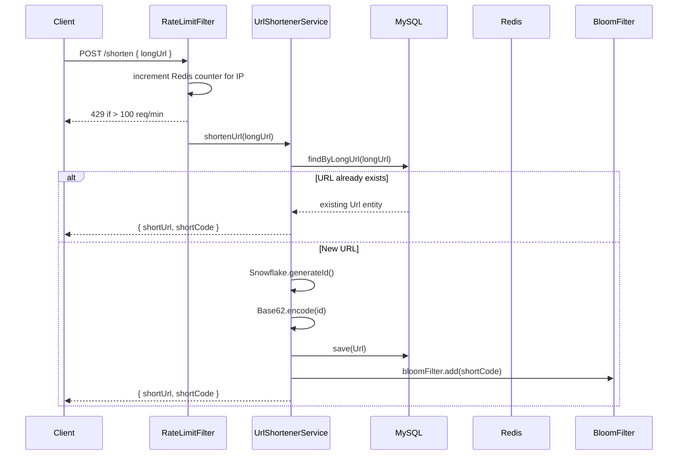
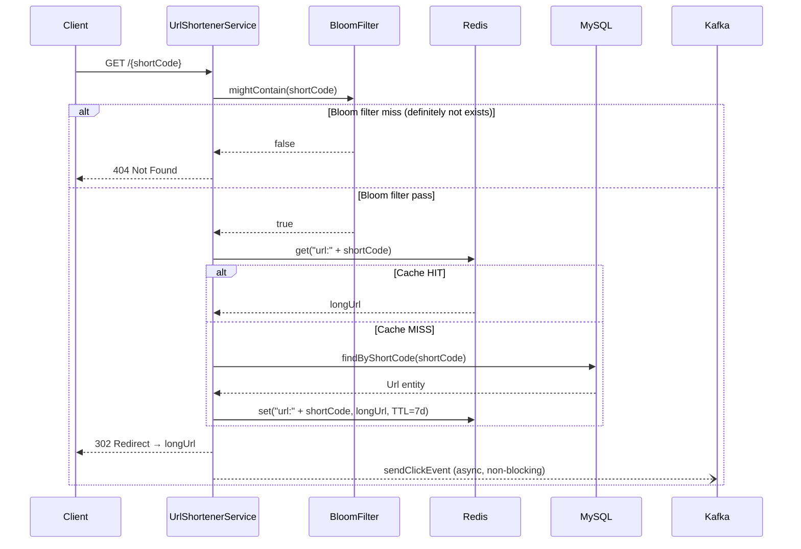
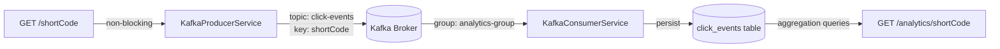

# Distributed URL Shortener

A production-grade URL shortening service built with Java 17 and Spring Boot 4. Designed for high throughput with sub-10ms redirect latency at scale, using a layered architecture: Bloom filter pre-check → Redis cache → MySQL persistence, with Kafka-backed async click analytics.

---

## Tech Stack

| Layer | Technology |
|---|---|
| Language | Java 17 |
| Framework | Spring Boot 4 |
| Primary DB | MySQL 8 |
| Cache | Redis |
| Messaging | Apache Kafka |
| ID Generation | Custom Snowflake |
| Build | Maven |

---

## Architecture

### High-Level System Design

```mermaid
graph TD
    Client -->|POST /shorten| API[Spring Boot API]
    Client -->|GET /{shortCode}| API

    API -->|Shorten| RLS[RateLimiterService]
    RLS -->|Sliding window\nper IP in Redis| Redis

    API -->|Shorten| USS[UrlShortenerService]
    USS -->|1. findByLongUrl| MySQL[(MySQL\nurls table)]
    USS -->|2. Snowflake ID\n+ Base62 encode| SNF[SnowflakeIdGenerator]
    USS -->|3. Save new URL| MySQL
    USS -->|4. bloomFilter.add| BF[BloomFilter\nin-memory]

    API -->|Redirect| USS
    USS -->|1. bloomFilter.mightContain| BF
    USS -->|2. Cache hit?| Redis
    USS -->|3. Cache miss → fetch + cache| MySQL

    API -->|Async| KP[KafkaProducerService]
    KP -->|click-events topic| Kafka[(Kafka)]
    Kafka -->|KafkaListener| KC[KafkaConsumerService]
    KC -->|Save ClickEvent| MySQL

    API -->|GET /analytics/:code| AQS[AnalyticsQueryService]
    AQS -->|totalClicks\ndailyClicks\nreferrers| MySQL
```

---

### Shorten URL Flow



---

### Redirect Flow



---

### Snowflake ID Structure

```
 63        22        12        0
 |---------|---------|---------|
 41 bits   10 bits   12 bits
 timestamp machineId sequence
```

- **41 bits** timestamp (ms since custom epoch Jan 1 2024) → ~69 years of IDs
- **10 bits** machine ID → 1024 unique nodes
- **12 bits** sequence → 4096 IDs per millisecond per node
- **Total throughput:** ~4M IDs/sec across 1024 nodes, zero coordination required

---

### Bloom Filter

Pre-check layer before Redis and MySQL on every redirect. Eliminates DB hits for non-existent short codes.

```
mightContain(shortCode)
    → hash1(code) = (hashCode & 0x7fff) % size
    → hash2(code) = (hashCode ^ hashCode>>>16 & 0x7fff) % size
    → hash3(code) = (h1 + h2) % size
    → returns bitSet[h1] && bitSet[h2] && bitSet[h3]
```

| Parameter | Value |
|---|---|
| Bit array size | 1,000,000 bits (~125 KB) |
| Hash functions | 3 |
| False positive rate | < 1% at low cardinality |
| Startup hydration | Loaded from DB on `ApplicationRunner` |
| Thread safety | `add()` synchronized |

---

### Rate Limiter

Sliding window counter per IP using Redis atomic `INCR` + `EXPIRE`.

```
key = "rate_limit:{ip}"
count = INCR key
if count == 1 → EXPIRE key 60s
if count > 100 → return 429
```

Window resets after 60s from first request in that window. Handles `X-Forwarded-For` for clients behind proxies.

---

### Kafka Click Analytics Pipeline



Analytics decoupled from the redirect hot path — redirect latency is never blocked by DB writes.

---

## Database Schema

```sql
CREATE TABLE urls (
    id          BIGINT PRIMARY KEY,          -- Snowflake ID
    short_code  VARCHAR(10)  NOT NULL UNIQUE,
    long_url    TEXT         NOT NULL,
    created_at  TIMESTAMP,
    version     BIGINT,                      -- optimistic locking
    INDEX idx_long_url (long_url(255))       -- deduplication lookup
);

CREATE TABLE click_events (
    id          BIGINT AUTO_INCREMENT PRIMARY KEY,
    short_code  VARCHAR(10),
    clicked_at  TIMESTAMP,
    ip_address  VARCHAR(45),
    user_agent  TEXT,
    referrer    TEXT,
    INDEX idx_short_code (short_code)        -- analytics queries
);
```

---

## API Reference

### POST /shorten

Shorten a long URL. Idempotent — same long URL always returns the same short code.

**Request**
```json
{ "longUrl": "https://example.com/very/long/path" }
```

**Response** `200 OK`
```json
{
  "shortUrl": "http://localhost:8080/aB3xYz",
  "shortCode": "aB3xYz"
}
```

**Errors**
- `400` — blank URL or invalid URL format
- `429` — rate limit exceeded (> 100 req/min per IP)

---

### GET /{shortCode}

Redirect to the original URL. Fires an async Kafka click event.

**Response** `302 Found` → `Location: <originalUrl>`

**Errors**
- `404` — short code not found

---

### GET /analytics/{shortCode}

Click analytics for a short URL.

**Response** `200 OK`
```json
{
  "totalClicks": 1482,
  "dailyClicks": [
    { "date": "2024-06-01", "clicks": 312 },
    { "date": "2024-06-02", "clicks": 405 }
  ],
  "referrers": [
    { "referrer": "direct", "clicks": 890 },
    { "referrer": "https://twitter.com", "clicks": 592 }
  ]
}
```

---

## Running Locally

**Prerequisites:** Java 17, Maven, MySQL 8, Redis, Kafka

```bash
# 1. Clone
git clone https://github.com/Ishitasanap5/URL-Shortener.git
cd URL-Shortener

# 2. Create DB
mysql -u root -p -e "CREATE DATABASE urlshortener;"

# 3. Configure
# src/main/resources/application.properties
spring.datasource.url=jdbc:mysql://localhost:3306/urlshortener
spring.datasource.username=<your_username>
spring.datasource.password=<your_password>
app.base-url=http://localhost:8080/

# 4. Start Kafka (if using Docker)
docker run -d -p 9092:9092 apache/kafka:3.7.0

# 5. Run
mvn spring-boot:run
```

---

## Design Decisions

**Why Snowflake IDs over UUID?**
UUIDs are random → cause B-tree index fragmentation on insert-heavy workloads. Snowflake IDs are monotonically increasing → sequential inserts, better index locality, smaller storage (8 bytes vs 16 bytes).

**Why Bloom filter before Redis?**
Redirect requests for non-existent short codes (typos, scraping) would otherwise hit Redis first, then MySQL on a miss. The in-memory Bloom filter eliminates this entire class of lookups at the cost of ~125KB RAM and a guaranteed-false response.

**Why Kafka for click analytics?**
Synchronous DB writes on the redirect path would add 2–5ms latency per redirect under load. Kafka decouples the hot path from analytics persistence entirely. Click events are durable in Kafka and written to MySQL asynchronously by the consumer group.

**Why cache-aside over write-through?**
Write-through caches every new URL immediately. Cache-aside only populates Redis on first access, keeping memory usage proportional to actual traffic patterns rather than total URL count.

**Why Base62 over MD5/SHA hash?**
Hash-based approaches can collide and produce codes longer than needed. Base62 encoding of a Snowflake ID produces a deterministic, collision-free 7–8 character code (62^7 ≈ 3.5 trillion combinations).
